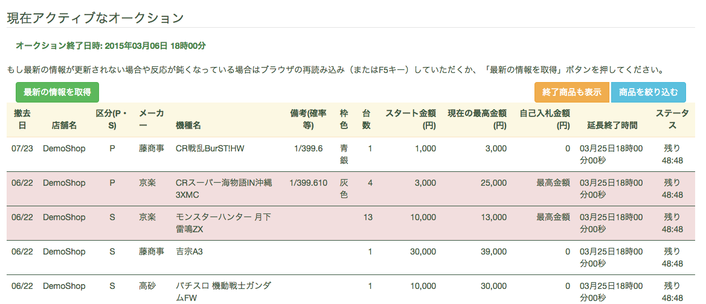
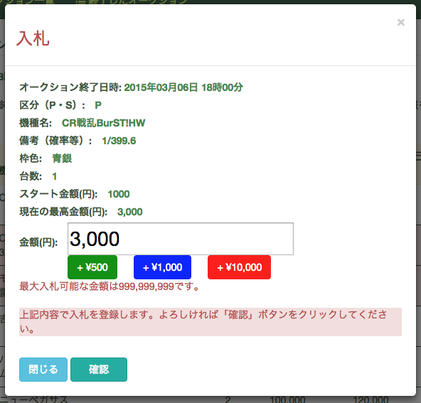
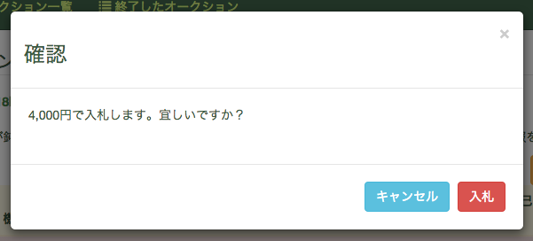
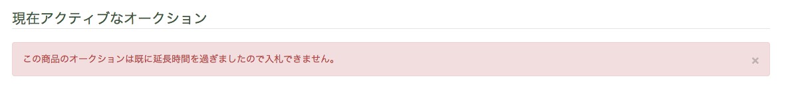
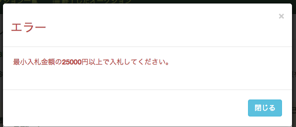
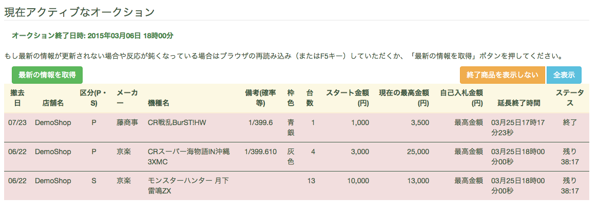
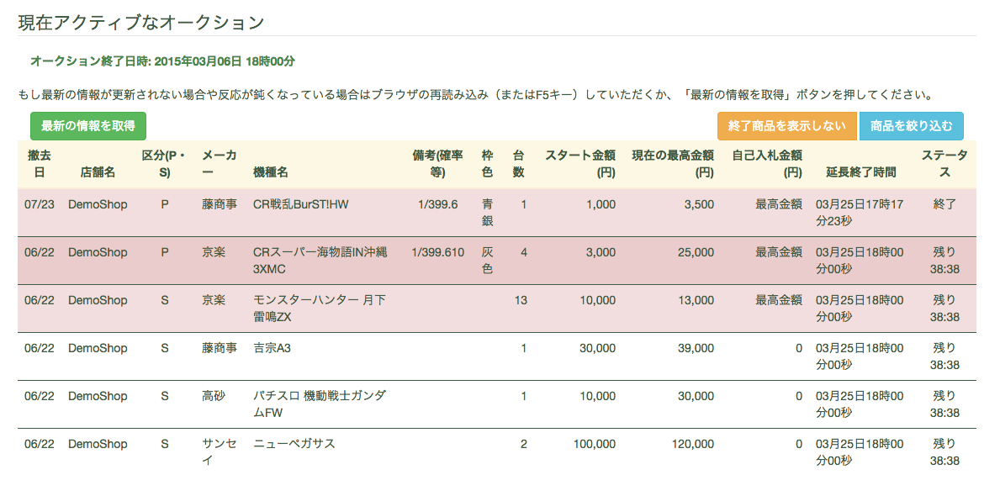
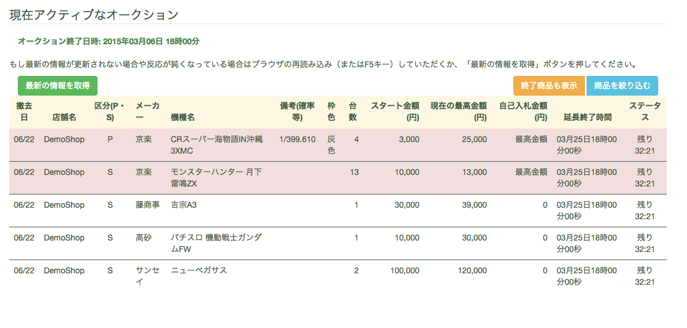

入札機能説明・操作
==================

入札
----

1. 現在アクティブなオークション一覧からオークションを選んでクリックすればオークションに該当する商品一覧が表示されます。
   |image|

2. 商品をクリックすれば入札ウィンドウが表示されます。金額欄に入札スタート金額があり、入力欄に直接入札金額を入力する又は横の「＋」をクリックすれば入札金額を増やせます。「＋」は100円ずつ入札金額を増やします。
   |image|

3. 入札ウィンドウの「確認」をクリックすると入札金額の確認ウィンドウが表示されます。金額を確認して「入札」をクリックすれば商品に入札できます。
   |image|

入札できない
------------

1. オークションが終了した商品をクリックした場合、入札できないというメッセージが表示されます。
   |image|

2. 現在の最高金額またはスタート金額以下で入札しようとした場合、入札できないというメッセージが表示されます。
   |image|

現在の最高金額の確認
--------------------

1. オークションの商品テーブルに「現在の最高金額(円)」の列で各商品の現時点での最高金額を確認できます。

2. ご自身の入札金額が最高入札金額の場合、テーブルの「自己入札金額(円)」列に「最高金額」と表示されます。

商品のステータス
----------------

1. まだ商品に入札がないかつ商品に入札できる場合、テーブルの「ステータス」列に終了迄の残り時間が表示されます。

2. 終了直前の5分間に商品に入札した場合、終了時間が現時間より5分延びて、5分以内に他人による入札がない場合、該当商品のオークションが終了し、テーブルの「ステータス」列に「終了」と表示されます。5分以内に他人による入札があった場合、また終了時間が現時間より5分延びます。

オークション中に商品を絞り込む・情報を更新
------------------------------------------

1. オークションの商品テーブルの上部の「商品を絞り込む」をクリックした場合、現在表示しているオークションに入札した商品一覧だけを表示することが出来ます。
   |image|

2. オークションの商品テーブルの上部の「終了商品も表示」をクリックした場合、現在表示しているオークションに終了した商品も一覧に表示することが出来ます。
   |image|

3. オークションの商品テーブルの上部の「最新の情報を取得」をクリックした場合、現在表示しているオークションの最新情報を表示することが出来ます。
   |image|

